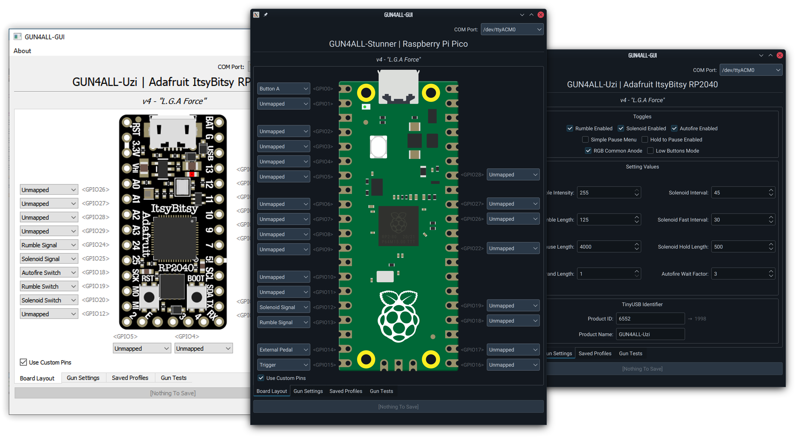

[](https://ko-fi.com/Z8Z5NNXWL)

# GUN4ALL-GUI
### Reference configuration utility for the open source [IR-GUN4ALL light gun system](https://github.com/SeongGino/ir-light-gun-plus), written in C++ & QT.

***Made for GUN4ALL v4.0 "L.G.A Force" and up.***

## Features:
 - Cross-platform QT application, portable across desktops to Pis and other OSes.
 - Simple to use: select the gun from the dropdown, and configure away!
 - See and manage current pins layout, toggle on and off custom mappings, set other tunables, and change the gun's USB identifier (with built-in decimal-to-hex conversion for your convenience!).
 - Also serves as a testing utility for button input and solenoid/rumble force feedback.

## Running:
Boards flashed with IR-GUN4ALL v4.0 (*L.G.A Force*) and up *must be plugged in **before** launching the application.* G4A GUI will notify if it can't find any compatible boards connected.

### For Linux:
##### Requirements: Anything with QT5 support.
 - Arch Linux: Install `gun4all-gui` [from the AUR.](https://aur.archlinux.org/packages/gun4all-gui)
 - Other distros: Try the latest binary (built for Ubuntu 20.04 LTS, but should work for most distros?)
 - Make sure your user is part of the `dialout` group (`# usermod -a -G dialout insertusernamehere`)

### For Windows:
##### Requirements: Windows 7 and up (64-bit only).
 - Download the latest release zip.
 - Extract the `G4A-GUI` folder from the archive to anywhere that's most convenient on your system - `G4A-GUI.exe` should be sitting next to `Qt5Core.dll` and others, as well as the `platforms` and `styles` folders.
 - Start `G4A-GUI.exe`

## Building:
### For Linux:
#### Requires `qt-base`, `qt-serialport`, `qt-svg`
 - Clone the repo:
   ```
   git clone https://github.com/SeongGino/GUN4ALL-GUI
   ```
 - Setup build directory:
   ```
   cd GUN4ALL-GUI
   mkdir build && mkdir build
   cmake .. -DCMAKE_BUILD_TYPE=Release
   ```
 - Make:
   ```
   make
   ```
 - And run:
   ```
   ./G4A-GUImain
   ```
### For Windows:
 - Should be buildable through CMake or the QT Creator IDE.
###### iunno man, [I don't use Windows anymore.](https://youtu.be/PAFvWdszwFA)

### TODO:
 - Finish/fix the currently non-functional "reboot to bootloader" method (even though it's using Earle's reference code nearly verbatim, it still doesn't work--might be a limitation of QT?)
 - Add icon, logo.
 - Holy shit the board layouts code is a MESS rn.
 - stop being tired all the time

### Special Thanks:
 - Samuel Ballentyne, Prow7, and co. for their work on the SAMCO system that lead to the creation of GUN4ALL.
 - ArcadeForums posters that voiced their thoughts and suggestions for the GUN4ALL project.
 - GUN4ALL testers and everyone that provided feedback to GUN4ALL.
 - Sleep deprivation
 - Stubbornness
 - And Autism
