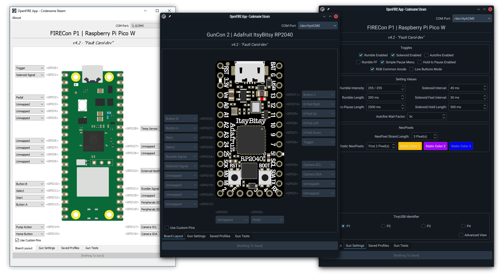

#### Like our work? [Remember to support the developers!](https://github.com/TeamOpenFIRE/.github/blob/main/profile/README.md)


# OpenFIRE App
### Reference configuration utility for the [OpenFIRE light gun system](https://github.com/TeamOpenFIRE/OpenFIRE-Firmware), written in Qt & C++.

## Features:
 - **Cross-platform Qt application,** portable across Linux & Windows desktops & Raspberry Pi systems.
 - **Simple to use:** select the gun from the dropdown, and configure away!
 - See and manage current pins layout, toggle on and off custom mappings, set other tunables, and change the gun's USB identifier all on the fly.
 - Calibrate any of the loaded profiles using an intuitive fullscreen interface, making things 
 - Also serves as a testing utility for button input, solenoid/rumble force feedback, and camera.

## Running:
Boards flashed with OpenFIRE *must be plugged in **before** launching the application.* The app will notify if it can't find any compatible boards connected.

### For Linux:
##### Requirements: Anything that supports Qt 5.15.X at minimum.
 - Arch Linux: AUR PKGBUILD @ [`openfireapp`](https://aur.archlinux.org/packages/openfireapp)
 - Other distros: Use `OpenFIRE_App-x86_64.AppImage` [from the releases page](https://github.com/TeamOpenFIRE/OpenFIRE-App/releases/latest)
 - Make sure your user is part of the `dialout` group (`# usermod -a -G dialout insertusernamehere`); you'll be notified on startup if this is necessary. Log out and back in again for the change to take effect.
   - If you get the error message `usermod: group 'dialout' does not exist` when running the command above, you'll need to create the group (`# groupadd dialout`) and reboot for the change to take effect before trying again.

### For Windows:
##### Requirements: Windows 10 and up (64-bit only).
 - Download the [latest release zip.](https://github.com/TeamOpenFIRE/OpenFIRE-App/releases/latest)
 - Extract the `OpenFIREapp` folder from the archive to anywhere that's most convenient on your system - `OpenFIREapp.exe` should be sitting next to `Qt5Core.dll` and others, as well as the `platforms` and `styles` folders.
 - Start `OpenFIREapp.exe`
##### Though the Qt 5 version of the App will run on as far back as Windows 7, the RP2040 drivers requires Windows 10 *at minimum.* You will run into unforeseen issues trying to force Windows 7 compatibility that can be fixed by upgrading to a supported OS.

## Building:
### For Linux:
#### Arch: requires `qtX-base` `qtX-serialport` `qtX-svg` for your desired Qt version.
#### Debian: requires `build-essential` `cmake` `qttools5-dev` `libqt5serialport5-dev` `libqt5svg5-dev` (for Qt5, also works with Qt6 libraries)
 - Clone the repo:
   ```
   git clone https://github.com/TeamOpenFIRE/OpenFIRE-App
   ```
 - Setup build directory:
   ```
   cd OpenFIRE-App
   mkdir build && cd build
   cmake .. -DCMAKE_BUILD_TYPE=Release
   ```
   * The CMake build script will build using the latest available Qt version's development headers. To build using Qt5 if your system has Qt6 installed, add `-DOFAPP_QT_VERSIONS=Qt5` to the build options.
 - Make:
   ```
   make
   ```
 - And run:
   ```
   ./OpenFIREapp
   ```
### For Windows:
#### Qt 5.15.2 needs to be installed from the Archive section of the Qt Installation Wizard/Maintenance Tool, which comes with all needed additional components
#### Qt 6.x requires installing the respective SerialPort extension for the version
 - Should be buildable through CMake w/ msys2 (follow Arch Linux instructions) or the Qt Creator IDE.

### TODO:
 - Implement version comparison to latest OpenFIRE GitHub release (or at least latest as of the GUI version).
 - Add one-click firmware installation/updating from GUI (for both already flashed guns AND RP2040 devices in bootloader mode).

### Special Thanks:
 * Samuel Ballentyne, Prow7, and co. for their work on the SAMCO system & derivatives, and supporting work and conception of OpenFIRE.
 * Odwalla-J, mrkylegp, RG2020 & lemmingDev for prerelease consultation, bug testing and feedback.
 * All early IR-GUN4ALL testers and ArcadeForums users whom provided early testing and feedback.
