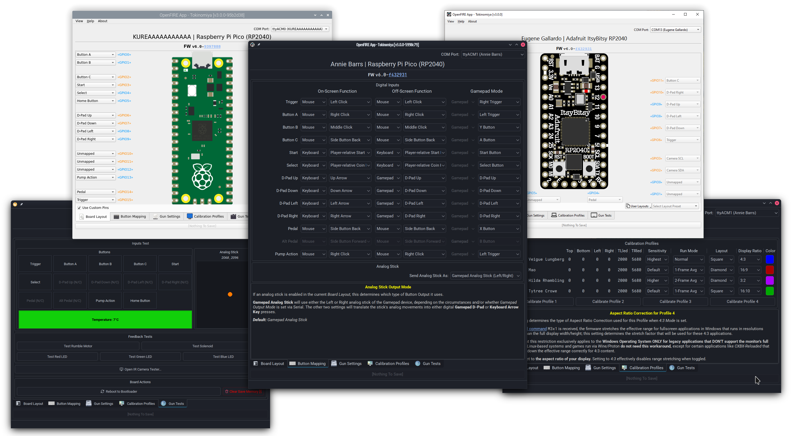
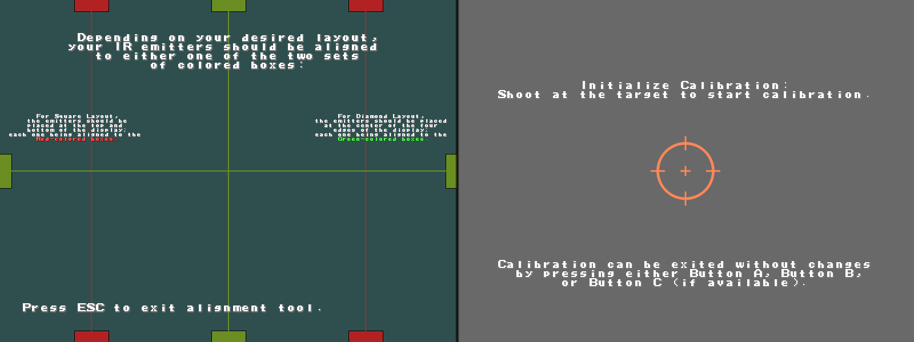

#### Like our work? [Remember to support the developers!](https://github.com/TeamOpenFIRE/.github/blob/main/profile/README.md)


# OpenFIRE Desktop Configuration App
### Reference configuration utility for the [OpenFIRE light gun system](https://github.com/TeamOpenFIRE/OpenFIRE-Firmware), written in Qt & C++.

## Features:
 - **Cross-platform Qt application,** portable across Linux & Windows desktops & Raspberry Pi systems.
 - **Simple to use:** Plug in and select the gun from the dropdown, and configure away!
 - See and manage current pins layout, toggle on and off custom mappings, manage other tunable settings such as FFB and I2C peripherals and more, all on the fly.
 - Calibrate any of the loaded profiles using an intuitive interactive fullscreen interface for easy and accurate calibrations.
 - View ideal alignment of emitters using the IR Emitter Alignment Assistant.
 - Preview all supported boards' layouts, including their capabilities (I2C type & channel, et al), to make building your OpenFIRE lightgun easier.
 - Also serves as a testing utility for digital and analog inputs, force feedback devices, camera, and more.

## Running:
Run `OpenFIREapp`. From the main window, available devices will be periodically refreshed and shown in the *COM Port* dropdown box. Even without any devices currently plugged in, you can still access the *IR Emitter Alignment Assistant* or preview supported boards and their default layouts by selecting *View Compatible Boards* from the *Help* app menu button.

When a board(s) is connected, select the port corresponding to your microcontroller to dock it to the app (undocking any currently docked board, if any). Devices that fail to communicate correctly with the App can be rebooted to their bootloader so they can be updated to the latest available firmware version.



### For Linux:
##### Requirements: Anything that supports Qt 5.15.X at minimum.
 - Arch Linux: Either of the following AUR PKGBUILDs:
   - [`openfireapp`](https://aur.archlinux.org/packages/openfireapp): Current Stable Builds
   - [`openfireapp-git`](https://aur.archlinux.org/packages/openfireapp-git): Unstable, built directly from source
 - Other distros: Use `OpenFIRE_App-[x86_64/aarch64].AppImage` [from the releases page](https://github.com/TeamOpenFIRE/OpenFIRE-App/releases/latest)
 - Make sure your user is part of the `dialout` group (`# usermod -a -G dialout insertusernamehere`); you'll be notified on startup if this is necessary. Log out and back in again for the change to take effect.
   - If you get the error message `usermod: group 'dialout' does not exist` when running the command above, you'll need to create the group (`# groupadd dialout`) and reboot for the change to take effect before trying again.

### For Windows:
##### Requirements: Windows 10 and up (64-bit only).
 - Download the [latest release zip.](https://github.com/TeamOpenFIRE/OpenFIRE-App/releases/latest)
 - Extract the `OpenFIREapp` folder from the archive to anywhere that's most convenient on your system - `OpenFIREapp.exe` should be sitting next to `Qt6Core.dll` and others, as well as the `platforms` and `styles` folders.
 - Start `OpenFIREapp.exe`
##### Though the Qt 5 version of the App will run on as far back as Windows 7, the RP2040 drivers requires Windows 10 *at minimum.* You will run into unforeseen issues trying to force Windows 7 compatibility that can be fixed by upgrading to a supported OS.

## Building:
### For Linux:
#### Arch: requires `qtX-base` `qtX-serialport` `qtX-svg` for your desired Qt version.
#### Debian: requires `build-essential` `cmake` `qttools5-dev` `libqt5serialport5-dev` `libqt5svg5-dev` (either Qt5 or Qt6 libraries)
 - Clone the repo (including the contents of [`boards/`](https://github.com/TeamOpenFIRE/OpenFIRE-Boards)):
   ```
   git clone https://github.com/TeamOpenFIRE/OpenFIRE-App --recursive
   ```
 - Setup build directory:
   ```
   cd OpenFIRE-App
   mkdir build && cd build
   cmake .. -DCMAKE_BUILD_TYPE=Release
   ```
   * The CMake build script will build using the latest available Qt version's development headers. To build using Qt5 if your system has Qt6 installed, add `-DOFAPP_QT_VERSION=Qt5` to the build options.
 - Make:
   ```
   make
   ```
 - And run:
   ```
   ./OpenFIREapp
   ```
### For Windows:
#### Qt 5.15.2 needs to be installed from the Archive section of the Qt Installation Wizard/Maintenance Tool, which comes with all needed additional components
#### Qt 6.x requires installing the respective SerialPort extension for the version
 - The project can be opened in the Qt Creator IDE, assuming the system has the appropriate Qt libraries for their desired version/environment installed. Alternatively, it should be buildable via CMake inside of an mingw-w64 environment, however this has yet to be tested adequately to be confirmed.

## Special Thanks:
 * Samuel Ballentyne, Prow7, and co. for their work on the SAMCO system & derivatives, and supporting work and conception of OpenFIRE.
 * Odwalla-J, mrkylegp, RG2020 & lemmingDev for prerelease consultation, bug testing and feedback.
 * All early IR-GUN4ALL testers and ArcadeForums users whom provided early testing and feedback.
